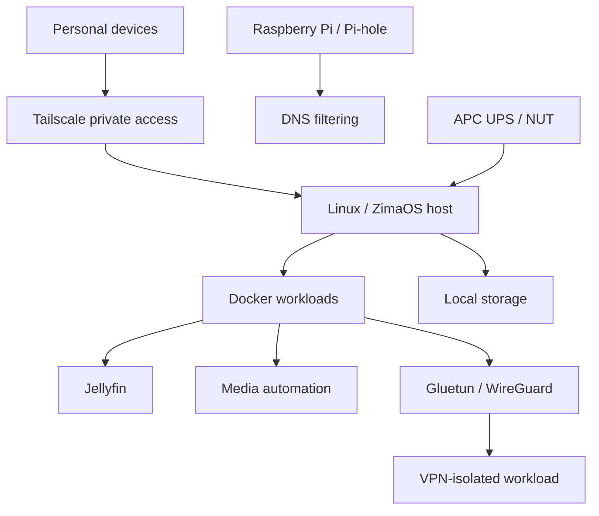

# Conceptual architecture

```mermaid
flowchart TD
  Client[Personal devices] --> Tail[Tailscale private access]
  Tail --> Host[Linux / ZimaOS host]
  Host --> Docker[Docker workloads]
  Docker --> Jelly[Jellyfin]
  Docker --> Auto[Media automation]
  Docker --> VPN[Gluetun / WireGuard]
  VPN --> Workload[VPN-isolated workload]
  Pi[Raspberry Pi / Pi-hole] --> DNS[DNS filtering]
  UPS[APC UPS / NUT] --> Host
  Host --> Storage[Local storage]
```

This is a conceptual overview, not a live network diagram. IP addresses, hostnames, ports, and device identities are intentionally omitted.
